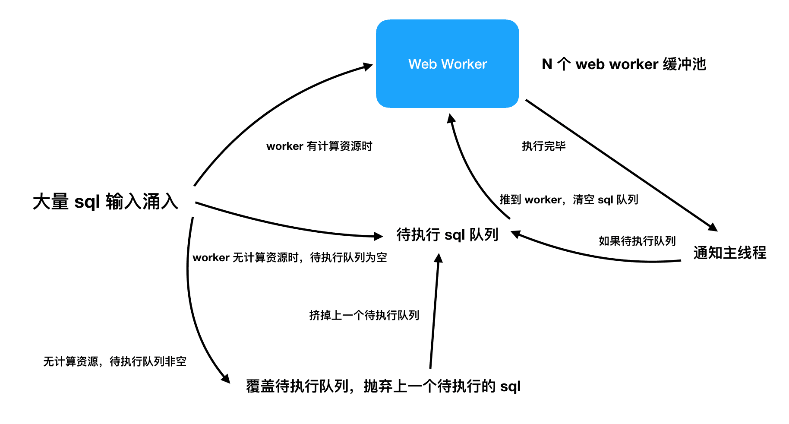

## Web Workers

优势

- 高效
- 并行

### 对象转移（Transferable Objects）

对象转移就是将对象引用零成本转交给 Web Workers 的上下文，而不需要进行结构拷贝。

这里要解释的是，**主线程与 Web Workers 之间的通信，并不是对象引用的传递，而是序列化/反序列化的过程**，当对象非常庞大时，序列化和反序列化都会消耗大量计算资源，降低运行速度。

对象转移使用方式很简单，给 `postMessage` 增加一个参数，把对象引用传过去即可：

```javascript
var ab = new ArrayBuffer(1);
worker.postMessage(ab, [ab]);
```

> 需要注意的是，对象引用转移后，原先上下文就无法访问此对象了，需要在 Web Workers 再次将对象还原到主线程上下文后，主线程才能正常访问被转交的对象。

### 如何不用 JS 文件创建 Web Workers

#### webpack 插件 - worker-loader

[worker-loader](https://github.com/webpack-contrib/worker-loader) 是一个 webpack 插件，可以将一个普通 JS 文件的全部依赖提取后打包并替换调用处，以 Blob 形式内联在源码中。

```javascript
import Worker from "worker-loader!./file.worker.js";

const worker = new Worker();
```

上述代码的魔术在于，转化成下面的方式执行：

```javascript
const blob = new Blob([codeFromFileWorker], { type: "application/javascript" });
const worker = new Worker(URL.createObjectURL(blob));
```

#### Blob URL

第二种方式由第一种方式自然带出：如果不想用 webpack 插件，那自己通过 Blob 的方式创建也可以：

```javascript
const code = `
  importScripts('https://xxx.com/xxx.js');
  self.onmessage = e => {};
`;

const blob = new Blob([code], { type: "application/javascript" });
const worker = new Worker(URL.createObjectURL(blob));
```

看上去代码更轻量一些，不过问题是当遇到复杂依赖时，如果不能把依赖都转化为脚本通过 `importScripts` 方式引用，就无法访问到主线程环境中的包。如果真的遇到了这个问题，可以用第一种 webpack 插件的方式解决，这个插件会自动把文件所有依赖都打包进源码。

### 管理 postMessage 队列

