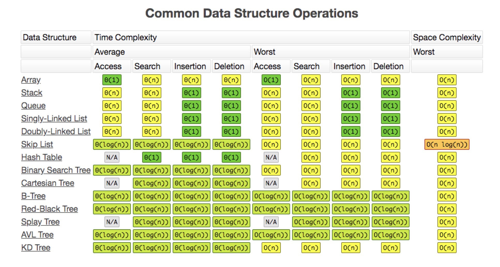

## 堆栈和队列

内存中的堆栈和数据结构堆栈不是一个概念，可以说**内存中的堆栈是真实存在的物理区**，数据结构中的堆栈是**抽象的数据存储结构**。
内存空间在逻辑上分为三部分：

- 代码区

> 存储方法体的二进制代码。高级调度（作业调度）、中级调度（内存调度）、低级调度（进程调度）控制代码区执行代码的切换。

- 静态数据区

> 存储全局变量、静态变量、常量，常量包括final修饰的常量和String常量。系统自动分配和回收。

- 动态数据区

> 动态数据区又分为栈区和堆区。
>
> 栈区：存储运行方法的形参、局部变量、返回值。由系统自动分配和回收。
> 堆区：new一个对象的引用或地址存储在栈区，指向该对象存储在堆区中的真实数据。

### Stack

- First In Last Out (FILO)
  - Array or Linked List

### Queue

- First In First Out (FIFO)
  - Arrary or Doubly Linked List

### PriorityQueue

正常入，按照优先级出

实现机制

- Heap(Binary,Binomial,Fibonacci)
- Binary Search Tree

